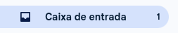
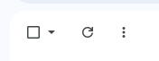
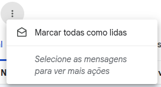

# mark-read-gmail
Script to mark all gmail emails as read

## 📋 Descrição
Este script automatiza o processo de marcar todos os emails não lidos do Gmail como lidos. Ele funciona simulando cliques nos botões da interface do Gmail.

## 🚀 Como usar

### 1. Preparação
1. Abra o Gmail no seu navegador
2. Faça login na sua conta
3. **IMPORTANTE**: Na barra de busca do Gmail, digite: `in:unread` e pressione Enter
   - Isso filtrará apenas os emails não lidos
   - É essencial para o funcionamento correto do script

### 2. Executar o script
1. Pressione **F12** para abrir o DevTools
2. Vá na aba **Console**
3. **Se necessário**: Digite `allow pasting` e pressione Enter para permitir colar código no console
4. Cole o código do arquivo `script.js` no console (com as variáveis atualizadas conforme esta documentação)
5. Pressione **Enter** para executar o script

### 3. O que o script faz
- Identifica a quantidade de emails não lidos
- Para cada email, clica no botão de opções (três pontos)
- Seleciona a opção "Marcar como lida"
- Repete até que todos os emails sejam marcados como lidos

## ⚙️ Configuração das variáveis

> **💡 Diferença entre seletores:**
> - **Classe CSS** (`.bsU`): Usa ponto (.) e se refere a elementos com uma classe específica
> - **ID do elemento** (`:1j`, `:nd`): Se refere a elementos com IDs únicos específicos

### VIEW_QUANTITY_UNREAD
```javascript
const VIEW_QUANTITY_UNREAD = '.bsU';
```

Esta variável se refere ao **campo de texto que mostra a quantidade de emails não lidos** ao lado da "Caixa de entrada". Note que utiliza um **seletor de classe CSS** (`.bsU`), conforme mostrado na imagem abaixo:

> **📸 Imagem de referência:**
> 
> 
> 
> 

### DOTS_BUTTON
```javascript
const DOTS_BUTTON = ':1j';
```

Esta variável se refere ao **botão de três pontos (⋮) do lado direito** de cada email na lista. Note que utiliza um **ID do elemento** (`:1j`), conforme mostrado na imagem abaixo:

> **📸 Imagem de referência:**
> 
> 
> 
> 

### MARK_AS_READ_BUTTON
```javascript
const MARK_AS_READ_BUTTON = ':nd';
```

Esta variável se refere ao botão **"Marcar todas como lidas"** que aparece no menu dropdown após clicar no botão de três pontos. Note que utiliza um **ID do elemento** (`:nd`), conforme mostrado na imagem abaixo:

> **📸 Imagem de referência:**
> 
> 
> 
> 

## ⚠️ Observações importantes

1. **Filtro obrigatório**: É essencial usar o filtro `in:unread` na busca do Gmail antes de executar o script. Sem isso, o script pode não funcionar corretamente.

2. **IDs dinâmicos**: Os IDs dos elementos do Gmail podem mudar. Se o script parar de funcionar, pode ser necessário inspecionar os elementos e atualizar os seletores.

3. **Execução gradual**: O script inclui delays entre as ações para evitar sobrecarregar a interface do Gmail.

4. **Verificação manual**: Recomenda-se verificar se o script está funcionando corretamente observando os emails sendo marcados como lidos.

5. **Console do navegador**: Alguns navegadores requerem que você digite `allow pasting` antes de permitir colar código no console por motivos de segurança.

## 🐛 Resolução de problemas

### Script não encontra os botões
- **Primeiro**: Certifique-se de ter usado o filtro `in:unread` na busca do Gmail
- Verifique se você está na página correta do Gmail
- Certifique-se de que há emails não lidos visíveis na tela
- Inspecione os elementos e atualize os seletores se necessário

### Script para no meio da execução
- Aguarde alguns segundos, o Gmail pode estar processando
- Recarregue a página e tente novamente
- Verifique se não há pop-ups ou notificações bloqueando a interface

## 📝 Licença
Este projeto é de uso livre para fins pessoais.
